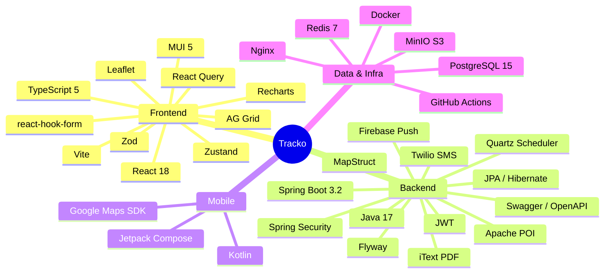
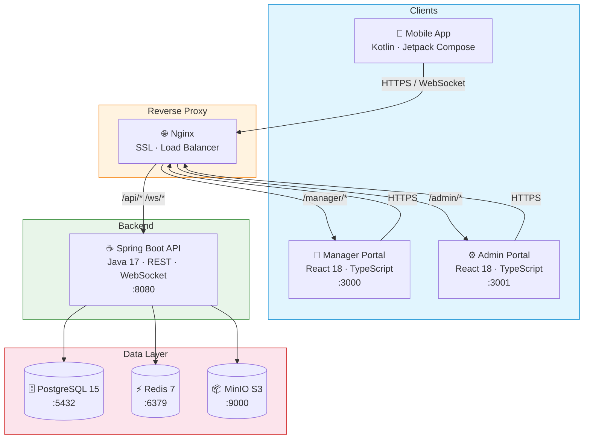
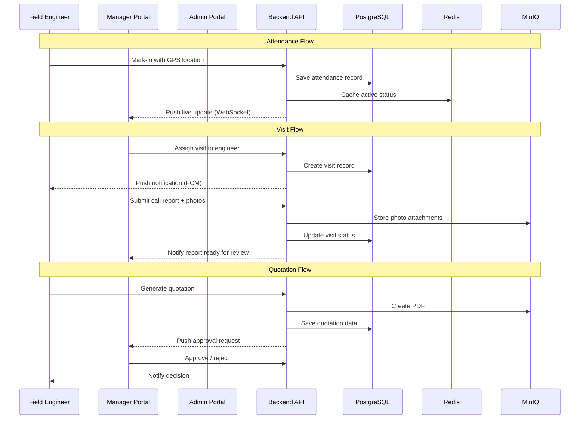
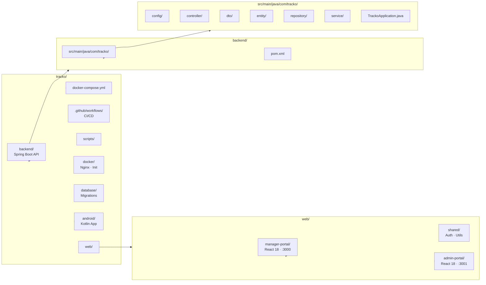

<p align="center">
  
  
  
  
  
  
  
</p>

<!-- GitHub Metadata -->
<!--
Tracko is a real-time field engineer management system built with Spring Boot and React.
It provides GPS tracking, attendance automation, visit scheduling, quotation management, and performance scorecards for field service operations.
-->

<h1 align="center">Tracko</h1>
<p align="center">
  <strong>Field Engineer Management System</strong><br>
  Real-time tracking · Attendance · Visits · Quotations · Scorecards
</p>

<p align="center">
  <a href="https://github.com/rahulmasal/Tracko/stargazers"></a>
  <a href="https://github.com/rahulmasal/Tracko/network/members"></a>
  <a href="https://github.com/rahulmasal/Tracko/issues"></a>
  <a href="https://github.com/rahulmasal/Tracko/blob/main/LICENSE"></a>
</p>

<p align="center">
  <a href="#-features">Features</a> •
  <a href="#-tech-stack">Tech Stack</a> •
  <a href="#-architecture">Architecture</a> •
  <a href="#-quick-start">Quick Start</a> •
  <a href="#-project-structure">Structure</a> •
  <a href="#-about">About</a>
</p>

---

## Overview

Tracko is a comprehensive platform for managing field engineer operations. It provides real-time GPS tracking, attendance management, visit scheduling, enquiry/lead management, quotation generation, leave management, and performance scorecards — all through dedicated web portals for managers and admins.

## Features

| Module | Capabilities |
|--------|-------------|
| **Live Tracking** | Real-time GPS tracking with Leaflet maps, geofencing, ping-based location updates |
| **Attendance** | Mark-in/Mark-out with exceptions, team attendance overview, auto-reminders |
| **Visits & Calls** | Visit scheduling, call report submission with photo attachments, pending reports review |
| **Enquiries & Leads** | Lead capture, enquiry pipeline management, status tracking |
| **Quotations** | PDF generation, approval workflow, timeline tracking, branded templates |
| **Leave Management** | Leave applications, team calendar view, approval/rejection workflow |
| **Scorecards** | Performance scoring, team rankings, configurable score formulas |
| **Admin Panel** | User & role management, branch & shift management, security policies, audit logs, system configuration |

## Tech Stack



## Architecture



## Data Flow



## Quick Start

### Prerequisites

- Java 17+
- Node.js 20+
- Docker & Docker Compose
- PostgreSQL 15 (for local dev without Docker)

### Docker (Recommended)

```bash
git clone https://github.com/rahulmasal/Tracko.git
cd tracko
cp .env.example .env
docker compose up -d
```

| Service | URL |
|---------|-----|
| Manager Portal | http://localhost:3000 |
| Admin Portal | http://localhost:3001 |
| API | http://localhost:8080/api |
| Swagger UI | http://localhost:8080/swagger-ui.html |

### Local Development

**Backend**

```bash
cd backend
./mvnw spring-boot:run
```

**Web Portals**

```bash
cd web/manager-portal
npm install && npm run dev

cd web/admin-portal   # separate terminal
npm install && npm run dev
```

**Mobile App**

Open `android/` in Android Studio and run on device or emulator.

## Project Structure



## Default Credentials

| Role | Email | Password |
|------|-------|----------|
| Admin | admin@tracko.com | Admin@123 |

## API Documentation

Available via Swagger UI when the backend is running:

- **Swagger UI**: http://localhost:8080/swagger-ui.html
- **API Docs**: http://localhost:8080/api-docs

## About

Tracko (pronounced "track-oh") is a **field engineer management platform** designed to bridge the gap between office-based coordination and field-level execution. It was built with a modular, scalable architecture to handle the complexities of managing distributed engineering teams.

### Problem It Solves
Field service businesses struggle with:
- **Lack of real-time visibility** into engineer locations and activities
- **Manual, paper-based** attendance and visit tracking
- **Delayed communication** between field engineers and office teams
- **Fragmented tools** for quotations, leave management, and performance tracking

### How Tracko Helps
- 📍 **Live GPS tracking** with geofencing and automated attendance
- 📋 **Digital visit reports** with photo evidence and customer signatures
- 💰 **Instant quotations** with configurable approval workflows
- 📊 **Performance scorecards** with configurable scoring formulas
- 🔔 **Real-time notifications** via push, SMS, and email
- 🔒 **Enterprise security** with RBAC, audit logging, and device security checks

### Target Users
| Role | Portal | Key Capabilities |
|------|--------|-----------------|
| Field Engineer | Mobile App (Android) | Check-in/out, visit reporting, GPS tracking |
| Team Manager | Manager Portal (React) | Team oversight, leave approvals, live map |
| System Admin | Admin Portal (React) | User/role management, system config, audit logs |

### Built With
- **Backend:** Java 17 · Spring Boot 3.2 · PostgreSQL 15
- **Frontend:** React 18 · TypeScript 5 · MUI 5 · Vite
- **Mobile:** Kotlin · Jetpack Compose
- **Infrastructure:** Docker · Nginx · Redis 7 · MinIO

### Project Highlights
- **~363 source files** · **~87K words** of code and documentation
- **2,165 knowledge graph nodes** with **195 identified communities**
- **18.8x query reduction** through intelligent graph-based retrieval
- Full CI/CD with GitHub Actions for build, test, and Docker image builds

---

## License

Proprietary — All Rights Reserved
